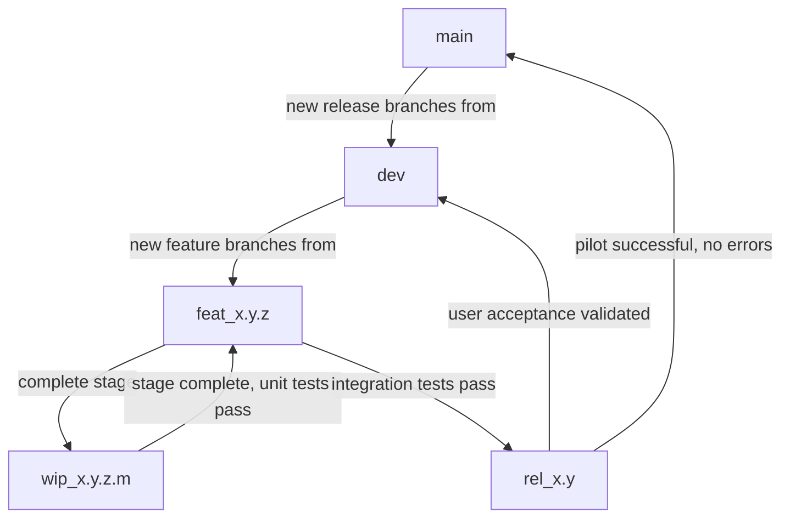

# Dibonit EGS

**Dibonit Entreprise Global Softwares (EGS)** is a Rust workspace containing enterprise services, applications, and common libraries designed for seamless interoperability within a manufacturing and business ecosystem.

## Vision

Dibonit EGS provides a **secure, clean, readable, and efficient** architecture for enterprise applications with:

- **Well-defined perimeters** for each application and service
- **Easy deployment and maintenance** across environments
- **Uncentralized centralized communication** via the Dibonit Enterprise Service Bus (ESB)
- **Modular design** allowing custom applications to integrate with existing enterprise systems

---

## Architecture Overview

### Core Component: Dibonit Enterprise Service Bus (ESB)

The ESB is the backbone of the Dibonit EGS ecosystem, handling all communication between enterprise applications and services. It centralizes the management of data flows while decentralizing their execution: data must not transit through an ESB server, but travel directly from caller to callee, with optimal performance and security. A cache can be configured so that redundant calls to the same remote data source, issued by multiple applications hosted on the same Docker host, are consolidated into a single network call.
#### ESB Components

| Component | Type | Purpose |
|-----------|------|---------|
| `d_esb_lib` | Library | Rust library used by internal applications to connect to the ESB |
| `d_esb_srv` | Service | Runs on each server or Docker container, managing local communication and routing to remote ESB instances |
| `d_esb_con` | Service | Connector service enabling external applications (non-Rust) to integrate with the ESB |

#### Supported Connector Protocols (d_esb_con)

- SECS (Semiconductor Equipment Communication Standard)
- MODBUS (Industrial communication protocol)
- TCP (Raw socket communication)
- Web Services (SOAP, REST)
- APIs (HTTP/HTTPS endpoints)

#### Communication Flow

```
                     EXTERNAL APPS                       ESB                                    INTERNAL APPS
                    ┌─────────────────┐     ┌─────────────────┐     ┌─────────────────┐     ┌─────────────────┐
DOCKER1             │   ERP System    │◀───▶│    Connector    │◀───▶│   ESB Service   │◀───▶│   BUSINESS APP1 │
                    │                 │     │ (d_esb_con)     │     │ (d_esb_srv)     │     │ (dibonit_xxx)   │
                    └─────────────────┘     └─────────────────┘     │                 │     └─────────────────┘
                                                                    │                 │     ┌─────────────────┐
                                                                    │                 │◀───▶│   BUSINESS APP2 │
                                                                    │                 │     │ (dibonit_xxx)   │
                                                                    └─────────────────┘     └─────────────────┘
                                                                                    ▲
                                                                                    │
                                                                                    ▼
                    ┌─────────────────┐     ┌─────────────────┐     ┌─────────────────┐     ┌─────────────────┐
DOCKER2             │   MES System    │◀───▶│    Connector    │◀───▶│   ESB Service   │◀───▶│   MANUF APP1    │
                    │                 │     │ (d_esb_con)     │     │ (d_esb_srv)     │     │ (dibonit_xxx)   │
                    └─────────────────┘     └─────────────────┘     │                 │     └─────────────────┘
                                                                    │                 │     ┌─────────────────┐
                                                                    │                 │────▶│   MANUF APP2    │
                                                                    │                 │     │ (dibonit_xxx)   │
                                                                    └─────────────────┘     └─────────────────┘
```

### Application Organization

Applications are organized into **enterprise blocks**, each representing a functional domain:

- **IT Services**: Infrastructure, tools, and utilities
- **Manufacturing**: Production systems and MES
- **Shop Floors**: Automation, facilities, and production lines
- **Process**: Process flows and lines management (from product creation to final)
- **Production**: Production zone and row management (for specific types of process tools)
- **Maintenance**: Gmao
- **Enterprise**: Softwares at enterprise level
- **ERP**: Enterprise Resource Planning
- **Messaging**: User communication and object linking
- **Drive**: Document and file management

Each block publishes and receives data **exclusively through the ESB**, ensuring loose coupling and clear contract boundaries.

### Contracts

Contracts define the message exchange agreements between applications and the ESB. Each contract specifies:

- **Message type**: Request, response, event, command
- **Payload structure**: Data format and validation rules (to check if that will not be too hard to maintain, maybe there will just be raw data)
- **Permissions**: Which applications can send/receive each message type
- **Routing rules**: How messages are directed between applications

#### Example Contract

**Contract: `GET_CUSTOMER_PRODUCT_ORDER`**
- **Publisher**: ERP System
- **Subscribers**: MES, Automation Systems
- **Request**: `{ customer_id: String }` (to check)
- **Response**: `{ customer_id: String, products: Vec<ProductOrder> }` (to check)
- **Description**: Retrieves all products ordered by a specific customer

**Contract: `ASK_CUSTOMER_PRODUCT_ORDER`**
- **Publisher**: MES System
- **Subscribers**: ESB (for validation and routing)
- **Payload**: `{ customer_id: String }`
- **Description**: MES requests product order information for a customer

---

## Workspace Structure

```
dibonit_egs/
├── Cargo.toml                    # Workspace root configuration
├── README.md                     # This document
├── it/                           # IT Services block
│   ├── dibonit_esb/              # Enterprise Service Bus
│   │   ├── d_esb_lib/            # ESB Rust library
│   │   ├── d_esb_srv/            # ESB service
│   │   └── d_esb_con/            # Connector service
│   ├── dibonit_itt/              # IT Tools application
│   │   └── d_cry_srv/            # Encryption services/library
│   ├── dibonit_its/              # IT Services application
│   ├── dibonit_lbl/              # Load balancer
│   └── common/                   # Common IT libraries
│       ├── d_err_lib/            # Error management
│       └── d_log_lib/            # Logging management
│
└── manuf/                        # Manufacturing block
    ├── dibonit_mes_app/          # Manufacturing Execution System
    └── shopfloors/
        ├── d_aut_app/            # Automation software
        ├── d_fac_app/            # Facilities management
        └── d_flw_app/            # Production flows

├── d_erp_app/                    # ERP System
├── d_msg_app/                    # Messaging system
└── d_drv_app/                    # Drive system
```

---

## Getting Started

### Prerequisites

- Rust 1.70+ (recommended: latest stable)
- Cargo (comes with Rust)
- Docker (optional, for containerized deployment)
- PostgreSQL/MySQL (for database services)

### Installation

```bash
# Clone the repository
git clone https://github.com/Mickael4238/dibonit_egs.git
cd dibonit_egs

# Build the entire workspace
cargo build --workspace

# Run tests
cargo test --workspace
```

### Development Setup

```bash
# Build a specific component
cargo build -p d_esb_lib
cargo build -p d_esb_srv

# Run a service
cargo run -p d_esb_srv

# Run with logging
RUST_LOG=debug cargo run -p d_esb_srv
```

---

## Versioning Strategy

### Semantic Versioning

This project follows semantic versioning principles:
- **MAJOR**: Breaking changes, incompatible API modifications (a +1 version shall be compatible with its -1, but raise a deprecated warning when a +2 version will not be able anymore to handle the request)
- **MINOR**: Backward-compatible new features
- **PATCH**: Backward-compatible bug fixes

### Branch Strategy

| Branch Type | Pattern | Purpose | Deployment Target |
|-------------|---------|---------|-------------------|
| `main` | `main` | Production-ready safe releases | Production |
| `dev` | `dev` | Integration of validated features | N/A |
| `feat_x.y.z_<desc>` | `feat_0.1.0_new_feature` | Work in progress features | Dev environment |
| `wip_x.y.z.m_<desc>` | `wip_0.1.0.0_feature_stage` | Work in progress (sub-feature) | Local only |
| `rel_x.y_<desc>` | `rel_0.1_testing` | Release candidate for QA | Qualification |

### Branch Workflow



### Commit Message Convention

```
<type>(<scope>): <description>

[optional body]

[optional footer]
```

Types: `feat`, `fix`, `docs`, `style`, `refactor`, `test`, `chore`

Example:
```
feat(esb): add message validation middleware

- Add JSON schema validation for incoming messages
- Support custom validation rules per contract
- Update d_esb_lib to include validation module

Closes #123
```

---

## Current Focus: ESB Library (d_esb_lib)

The immediate priority is developing the **d_esb_lib** library, which provides:

- **Message serialization/deserialization** for ESB communication
- **Connection management** to ESB service instances
- **Contract enforcement** at the client level
- **Error handling** for communication failures
- **Retry and timeout** mechanisms
- **Authentication and authorization** helpers

esb_lib is the client library intended for all applications that need to connect to esb_srv.  Its purpose is to enable high-throughput data exchange between one running service esb_srv and multiple applications using esb_lib on the same Docker host.

esb_lib holds the contracts published by esb_srv in memory and rejects any message from a client application that does not conform to them. Once a message is validated against the contract, its payload may be encrypted (the current encryption implementation is a no-op placeholder) and transmitted to esb_srv.

Connection to esb_srv must be secured, for example through a local SSH key or an equivalent mechanism; unauthorized applications must be rejected. Upon connection, the application sends its trigram so that esb_srv can identify the caller. The message name remains in clear text, as esb_srv requires it for routing.

### Next Steps for ESB Library

1. **Define core message types** and serialization format
2. **Implement connection pool** for ESB service communication
3. **Create contract registry** for client-side validation
4. **Build error handling** framework
5. **Add logging and tracing** support
6. **Write unit tests** for all components
7. **Create integration tests** with d_esb_srv

---

## Deployment

### Docker Deployment

```bash
# Build Docker image for a service
docker build -t dibonit/d_esb_srv -f it/dibonit_esb/d_esb_srv/Dockerfile .

# Run the service
docker run -d --name esb-service -p 8080:8080 dibonit/d_esb_srv
```

### Kubernetes Deployment

```yaml
# Example deployment for ESB service
apiVersion: apps/v1
kind: Deployment
metadata:
  name: dibonit-esb
spec:
  replicas: 3
  selector:
    matchLabels:
      app: dibonit-esb
  template:
    metadata:
      labels:
        app: dibonit-esb
    spec:
      containers:
      - name: esb
        image: dibonit/d_esb_srv:latest
        ports:
        - containerPort: 8080
```

---

## Contributing

### Code Standards

- Follow Rust best practices and idioms
- Use `clippy` for linting: `cargo clippy --workspace`
- Format code with `cargo fmt --workspace`
- All public APIs must be documented with `///` comments
- All errors must be properly typed and handled

### Pull Request Process

1. Branch from the appropriate base branch (feat, wip, etc.)
2. Make small, focused commits
3. Ensure all tests pass
4. Ensure code is formatted and passes clippy
5. Submit PR with clear description and references to related issues
6. Await review and address feedback

### Testing

- **Unit tests**: Test individual functions and modules
- **Integration tests**: Test component interactions
- **Contract tests**: Verify message exchange contracts
- **E2E tests**: Test complete workflows

```bash
# Run all tests
cargo test --workspace

# Run tests with coverage
cargo tarpaulin --workspace
```

---

## License

This project is proprietary software. All rights reserved.

---

## Contact

For questions or support, please contact the project maintainer.

---

## Changelog

See [CHANGELOG.md](CHANGELOG.md) for release history.
